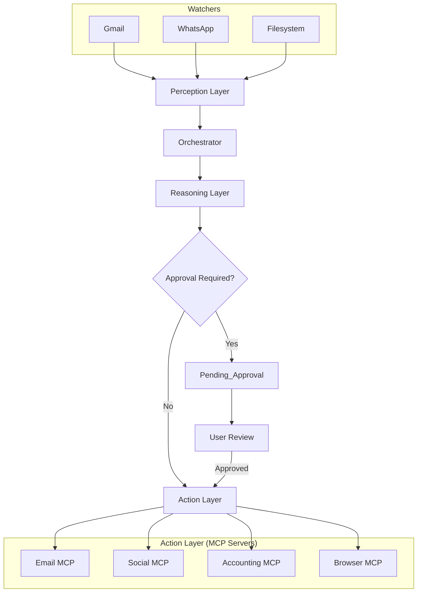

# Gold Tier Autonomous Employee

This system represents a fully autonomous AI agent capable of managing personal, business, financial, and social domains.

## Architecture



## Setup Instructions

1.  **Dependencies**:
    ```bash
    pip install -r requirements.txt
    cd mcp_servers/email-mcp && npm install
    cd ../social-mcp && npm install
    cd ../accounting-mcp && npm install
    cd ../browser-mcp && npm install
    ```

2.  **Odoo Setup**:
    - Install Odoo Community 17.0.
    - Enable JSON-RPC.
    - Create a user with API access.
    - Update `mcp_servers/accounting-mcp/.env`.

3.  **Run System**:
    ```bash
    # Terminal 1: Start all MCP Servers
    python scripts/run_servers.py
    
    # Terminal 2: Start the AI Agent (Watchers + Orchestrator)
    python run_silver.py
    ```

## Gold Tier Features

1.  **Cross-Domain Integration**: Handles Finance (Odoo), Social (FB/X/Insta), and Business communications.
2.  **Ralph Wiggum Loop**: The Orchestrator implements a retry loop ("I'm helping!") to ensure tasks are processed even if transient errors occur.
3.  **Audit System**: `scripts/weekly_audit.py` now pulls real-time stats from Odoo and Social media for the CEO Briefing.
4.  **Error Recovery**: `run_servers.py` includes a watchdog to restart crashed MCP servers automatically.

## Directory Structure

- `AI_Employee/`: Core Python logic.
- `mcp_servers/`: Node.js Action Servers.
    - `email-mcp`: Email & Calendar.
    - `social-mcp`: Facebook, Twitter, Instagram.
    - `accounting-mcp`: Odoo ERP.
    - `browser-mcp`: Puppeteer for web tasks.
- `scripts/`: Operational scripts.
- `vault/`: The "Brain" (Obsidian).

## Troubleshooting

- **Logs**: Check `AI_Employee/vault/Logs/` for detailed audit logs.
- **Approvals**: Monitor `AI_Employee/vault/Pending_Approval/` for blocked tasks.
